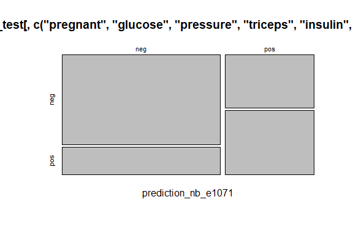

Business Intelligence Project
================
<Specify your name here>
<Specify the date when you submitted the lab>

- [Student Details](#student-details)
- [Setup Chunk](#setup-chunk)
- [Understanding the Dataset (Exploratory Data Analysis
  (EDA))](#understanding-the-dataset-exploratory-data-analysis-eda)
  - [Loading the Dataset](#loading-the-dataset)
    - [Source:](#source)
    - [Reference:](#reference)

# Student Details

|                                              |                                      |
|----------------------------------------------|--------------------------------------|
| **Student ID Number**                        | 127559,134775, 135863, 136346,134141 |
| **Student Name**                             |                                      |
| **BBIT 4.2 Group**                           | c                                    |
| **BI Project Group Name/ID (if applicable)** | Business Intelligent                 |

# Setup Chunk

``` r
#installing necessary packages

if(require("caret")){
  require("caret")
}else{
  install.packages("caret", dependencies = TRUE,
                   repos= "https://cloud.r-project.org")
}
```

    ## Loading required package: caret

    ## Loading required package: ggplot2

    ## Loading required package: lattice

``` r
if(require("klaR")){
  require("klaR")
}else{
  install.packages("klaR", dependencies = TRUE,
                   repos = "https://cloud.r-prject.org")
}
```

    ## Loading required package: klaR

    ## Loading required package: MASS

``` r
## e1071 ----
if (require("e1071")) {
  require("e1071")
} else {
  install.packages("e1071", dependencies = TRUE,
                   repos = "https://cloud.r-project.org")
}
```

    ## Loading required package: e1071

``` r
## readr ----
if (require("readr")) {
  require("readr")
} else {
  install.packages("readr", dependencies = TRUE,
                   repos = "https://cloud.r-project.org")
}
```

    ## Loading required package: readr

``` r
## LiblineaR ----
if (require("LiblineaR")) {
  require("LiblineaR")
} else {
  install.packages("LiblineaR", dependencies = TRUE,
                   repos = "https://cloud.r-project.org")
}
```

    ## Loading required package: LiblineaR

``` r
## naivebayes ----
if (require("naivebayes")) {
  require("naivebayes")
} else {
  install.packages("naivebayes", dependencies = TRUE,
                   repos = "https://cloud.r-project.org")
}
```

    ## Loading required package: naivebayes

    ## naivebayes 0.9.7 loaded

**Note:** the following KnitR options have been set as the global
defaults: <BR>
`knitr::opts_chunk$set(echo = TRUE, warning = FALSE, eval = TRUE, collapse = FALSE, tidy = TRUE)`.

More KnitR options are documented here
<https://bookdown.org/yihui/rmarkdown-cookbook/chunk-options.html> and
here <https://yihui.org/knitr/options/>.

# Understanding the Dataset (Exploratory Data Analysis (EDA))

## Loading the Dataset

``` r
if (require("mlbench")){
  require("mlbench")
} else {
  install.packages("mlbench", dependencies= TRUE,
                   repos= "https://cloud.r-project.org")
}
```

    ## Loading required package: mlbench

``` r
#getting/loading the Pima Indians Diabetes dataset from mlbench

data("PimaIndiansDiabetes")
```

### Source:

The dataset that was used can be downloaded here: *\<provide a link\>*

### Reference:

*\<Cite the dataset here using APA\>  
Refer to the APA 7th edition manual for rules on how to cite datasets:
<https://apastyle.apa.org/style-grammar-guidelines/references/examples/data-set-references>*

``` r
library(readr)

# Provide the executable R code inside the various code chunks as guided by the lab work.
```

\#splitting the dataset

``` r
train_index <- createDataPartition(PimaIndiansDiabetes$diabetes,
                                   p=0.80, list=FALSE)
diabetes_dataset_train <- PimaIndiansDiabetes[train_index,]
diabetes_dataset_test <- PimaIndiansDiabetes[-train_index,]
```

\#performing naive bayes

``` r
diabetes_dataset_nb_e1071 <-
  e1071::naiveBayes(diabetes~ pregnant+ glucose+ pressure+
                      triceps+ insulin+ mass+ pedigree+ age,
                    data=diabetes_dataset_train)
```

\#testing the model using the test dataset

``` r
prediction_nb_e1071 <-
  predict(diabetes_dataset_nb_e1071,
          diabetes_dataset_test[, c("pregnant", "glucose",
                                    "pressure","triceps","insulin", "mass",
                                    "pedigree","age")
            
          ])

print(prediction_nb_e1071)
```

    ##   [1] neg pos pos pos pos neg pos neg pos neg neg neg neg pos neg neg neg neg
    ##  [19] pos neg neg neg pos neg neg neg pos neg pos neg neg pos neg neg neg pos
    ##  [37] pos pos neg neg neg neg pos neg neg neg neg neg neg neg pos neg pos neg
    ##  [55] pos pos neg neg neg pos neg neg pos neg pos pos neg neg neg neg pos neg
    ##  [73] neg pos pos neg pos neg pos neg neg neg neg neg neg neg neg pos neg neg
    ##  [91] neg neg pos neg neg pos neg neg pos neg neg neg neg neg neg neg neg neg
    ## [109] neg pos neg neg neg neg pos pos neg neg neg pos pos pos neg pos neg neg
    ## [127] neg neg neg neg neg pos neg neg pos neg neg neg neg neg pos pos neg pos
    ## [145] neg neg neg neg neg neg pos neg neg
    ## Levels: neg pos

``` r
caret::confusionMatrix(prediction_nb_e1071,
                       diabetes_dataset_test[, c("pregnant", "glucose",
                                                 "pressure","triceps","insulin", "mass",
                                                 "pedigree","age","diabetes")]$diabetes)
```

    ## Confusion Matrix and Statistics
    ## 
    ##           Reference
    ## Prediction neg pos
    ##        neg  84  23
    ##        pos  16  30
    ##                                          
    ##                Accuracy : 0.7451         
    ##                  95% CI : (0.6684, 0.812)
    ##     No Information Rate : 0.6536         
    ##     P-Value [Acc > NIR] : 0.009661       
    ##                                          
    ##                   Kappa : 0.419          
    ##                                          
    ##  Mcnemar's Test P-Value : 0.336668       
    ##                                          
    ##             Sensitivity : 0.8400         
    ##             Specificity : 0.5660         
    ##          Pos Pred Value : 0.7850         
    ##          Neg Pred Value : 0.6522         
    ##              Prevalence : 0.6536         
    ##          Detection Rate : 0.5490         
    ##    Detection Prevalence : 0.6993         
    ##       Balanced Accuracy : 0.7030         
    ##                                          
    ##        'Positive' Class : neg            
    ## 

\#visualizing the prediction

``` r
plot(table(prediction_nb_e1071,
           diabetes_dataset_test[, c("pregnant", "glucose",
                                     "pressure","triceps","insulin", "mass",
                                     "pedigree","age","diabetes")]$diabetes))
```

<!-- -->

\#bootstrapping train control

``` r
train_control <- trainControl(method = "boot", number = 500)

str(diabetes_dataset_test)
```

    ## 'data.frame':    153 obs. of  9 variables:
    ##  $ pregnant: num  1 8 10 10 10 7 11 2 3 1 ...
    ##  $ glucose : num  85 183 115 168 139 100 138 90 180 73 ...
    ##  $ pressure: num  66 64 0 74 80 0 76 68 64 50 ...
    ##  $ triceps : num  29 0 0 0 0 0 0 42 25 10 ...
    ##  $ insulin : num  0 0 0 0 0 0 0 0 70 0 ...
    ##  $ mass    : num  26.6 23.3 35.3 38 27.1 30 33.2 38.2 34 23 ...
    ##  $ pedigree: num  0.351 0.672 0.134 0.537 1.441 ...
    ##  $ age     : num  31 32 29 34 57 32 35 27 26 21 ...
    ##  $ diabetes: Factor w/ 2 levels "neg","pos": 1 2 1 2 1 2 1 2 1 1 ...

``` r
diabetes_dataset_model_lm <- # nolint
  caret::train(diabetes ~
                 pregnant+ glucose+ pressure+
                 triceps+ insulin+ mass+ pedigree+ age,
               data = diabetes_dataset_train,
               trControl = train_control,
               na.action = na.omit, method = "glm", metric = "Accuracy")


predictions_lm <- predict(diabetes_dataset_model_lm,
                          diabetes_dataset_test[, 1:8])
```

\##View the RMSE and the predicted values for the 12 observations —-

``` r
print(diabetes_dataset_model_lm)
```

    ## Generalized Linear Model 
    ## 
    ## 615 samples
    ##   8 predictor
    ##   2 classes: 'neg', 'pos' 
    ## 
    ## No pre-processing
    ## Resampling: Bootstrapped (500 reps) 
    ## Summary of sample sizes: 615, 615, 615, 615, 615, 615, ... 
    ## Resampling results:
    ## 
    ##   Accuracy   Kappa    
    ##   0.7654081  0.4616597

``` r
print(predictions_lm)
```

    ##   [1] neg pos pos pos pos neg pos neg pos neg pos neg neg pos neg neg neg neg
    ##  [19] pos neg neg neg pos neg neg neg pos neg pos neg neg pos neg neg neg neg
    ##  [37] neg pos neg neg neg neg pos neg neg neg neg neg neg neg pos neg pos neg
    ##  [55] pos pos pos neg neg pos neg neg pos neg pos pos neg neg neg neg pos neg
    ##  [73] neg pos pos neg pos neg neg neg neg neg pos neg neg neg neg pos neg neg
    ##  [91] neg neg pos neg neg pos neg neg pos neg neg neg pos neg neg neg neg neg
    ## [109] neg neg neg neg neg neg pos neg neg pos neg neg pos pos neg pos neg neg
    ## [127] neg neg neg neg neg neg neg neg neg neg neg neg neg pos pos pos neg pos
    ## [145] neg neg neg neg neg neg pos pos neg
    ## Levels: neg pos

\#perfoming 10 fold cross validation

``` r
train_control <- trainControl(method = "cv", number = 10)

diabetes_dateset_model_lm_cv <-
  caret::train(diabetes ~ .,
               data = diabetes_dataset_train,
               trControl = train_control, na.action = na.omit,
               method = "glm", metric = "Accuracy")


predictions_lm_cv <- predict(diabetes_dateset_model_lm_cv, diabetes_dataset_test[, -9])


print(diabetes_dateset_model_lm_cv)
```

    ## Generalized Linear Model 
    ## 
    ## 615 samples
    ##   8 predictor
    ##   2 classes: 'neg', 'pos' 
    ## 
    ## No pre-processing
    ## Resampling: Cross-Validated (10 fold) 
    ## Summary of sample sizes: 553, 554, 554, 553, 554, 554, ... 
    ## Resampling results:
    ## 
    ##   Accuracy   Kappa    
    ##   0.7790323  0.4893262

``` r
print(predictions_lm_cv)
```

    ##   [1] neg pos pos pos pos neg pos neg pos neg pos neg neg pos neg neg neg neg
    ##  [19] pos neg neg neg pos neg neg neg pos neg pos neg neg pos neg neg neg neg
    ##  [37] neg pos neg neg neg neg pos neg neg neg neg neg neg neg pos neg pos neg
    ##  [55] pos pos pos neg neg pos neg neg pos neg pos pos neg neg neg neg pos neg
    ##  [73] neg pos pos neg pos neg neg neg neg neg pos neg neg neg neg pos neg neg
    ##  [91] neg neg pos neg neg pos neg neg pos neg neg neg pos neg neg neg neg neg
    ## [109] neg neg neg neg neg neg pos neg neg pos neg neg pos pos neg pos neg neg
    ## [127] neg neg neg neg neg neg neg neg neg neg neg neg neg pos pos pos neg pos
    ## [145] neg neg neg neg neg neg pos pos neg
    ## Levels: neg pos

\#performing Classification: SVM with Repeated k-fold Cross Validation

``` r
train_control <- trainControl(method = "repeatedcv", number = 5, repeats = 3)


diabetes_dateset_model_svm <-
  caret::train(diabetes ~ ., data = diabetes_dataset_train,
               trControl = train_control, na.action = na.omit,
               method = "svmLinearWeights2", metric = "Accuracy")

predictions_svm <- predict(diabetes_dateset_model_svm, diabetes_dataset_test)


print(diabetes_dateset_model_svm)
```

    ## L2 Regularized Linear Support Vector Machines with Class Weights 
    ## 
    ## 615 samples
    ##   8 predictor
    ##   2 classes: 'neg', 'pos' 
    ## 
    ## No pre-processing
    ## Resampling: Cross-Validated (5 fold, repeated 3 times) 
    ## Summary of sample sizes: 492, 492, 492, 492, 492, 492, ... 
    ## Resampling results across tuning parameters:
    ## 
    ##   cost  Loss  weight  Accuracy   Kappa     
    ##   0.25  L1    1       0.6341463  0.08218203
    ##   0.25  L1    2       0.6368564  0.14898781
    ##   0.25  L1    3       0.6617886  0.12923500
    ##   0.25  L2    1       0.7306233  0.36275257
    ##   0.25  L2    2       0.7121951  0.41296630
    ##   0.25  L2    3       0.5208672  0.16602039
    ##   0.50  L1    1       0.6520325  0.16735094
    ##   0.50  L1    2       0.6124661  0.11170918
    ##   0.50  L1    3       0.6298103  0.13521426
    ##   0.50  L2    1       0.7376694  0.38009233
    ##   0.50  L2    2       0.7181572  0.42343385
    ##   0.50  L2    3       0.5230352  0.16874986
    ##   1.00  L1    1       0.6455285  0.12543210
    ##   1.00  L1    2       0.6520325  0.13898705
    ##   1.00  L1    3       0.6428184  0.09130078
    ##   1.00  L2    1       0.7322493  0.36331607
    ##   1.00  L2    2       0.6970190  0.38162321
    ##   1.00  L2    3       0.5208672  0.16602039
    ## 
    ## Accuracy was used to select the optimal model using the largest value.
    ## The final values used for the model were cost = 0.5, Loss = L2 and weight = 1.

``` r
caret::confusionMatrix(predictions_svm, diabetes_dataset_test$diabetes)
```

    ## Confusion Matrix and Statistics
    ## 
    ##           Reference
    ## Prediction neg pos
    ##        neg  83  36
    ##        pos  17  17
    ##                                           
    ##                Accuracy : 0.6536          
    ##                  95% CI : (0.5725, 0.7286)
    ##     No Information Rate : 0.6536          
    ##     P-Value [Acc > NIR] : 0.53727         
    ##                                           
    ##                   Kappa : 0.1646          
    ##                                           
    ##  Mcnemar's Test P-Value : 0.01342         
    ##                                           
    ##             Sensitivity : 0.8300          
    ##             Specificity : 0.3208          
    ##          Pos Pred Value : 0.6975          
    ##          Neg Pred Value : 0.5000          
    ##              Prevalence : 0.6536          
    ##          Detection Rate : 0.5425          
    ##    Detection Prevalence : 0.7778          
    ##       Balanced Accuracy : 0.5754          
    ##                                           
    ##        'Positive' Class : neg             
    ## 

\#training a Naive Bayes classifier based on an LOOCV

``` r
train_control <- trainControl(method = "LOOCV")


diabetes_dataset_model_nb_loocv <-
  caret::train(diabetes ~ ., data = diabetes_dataset_train,
               trControl = train_control, na.action = na.omit,
               method = "naive_bayes", metric = "Accuracy")

predictions_nb_loocv <-
  predict(diabetes_dataset_model_nb_loocv, diabetes_dataset_test[, 1:9])

print(diabetes_dataset_model_nb_loocv)
```

    ## Naive Bayes 
    ## 
    ## 615 samples
    ##   8 predictor
    ##   2 classes: 'neg', 'pos' 
    ## 
    ## No pre-processing
    ## Resampling: Leave-One-Out Cross-Validation 
    ## Summary of sample sizes: 614, 614, 614, 614, 614, 614, ... 
    ## Resampling results across tuning parameters:
    ## 
    ##   usekernel  Accuracy   Kappa    
    ##   FALSE      0.7577236  0.4561237
    ##    TRUE      0.7544715  0.4414639
    ## 
    ## Tuning parameter 'laplace' was held constant at a value of 0
    ## Tuning
    ##  parameter 'adjust' was held constant at a value of 1
    ## Accuracy was used to select the optimal model using the largest value.
    ## The final values used for the model were laplace = 0, usekernel = FALSE
    ##  and adjust = 1.

``` r
caret::confusionMatrix(predictions_nb_loocv, diabetes_dataset_test$diabetes)
```

    ## Confusion Matrix and Statistics
    ## 
    ##           Reference
    ## Prediction neg pos
    ##        neg  84  23
    ##        pos  16  30
    ##                                          
    ##                Accuracy : 0.7451         
    ##                  95% CI : (0.6684, 0.812)
    ##     No Information Rate : 0.6536         
    ##     P-Value [Acc > NIR] : 0.009661       
    ##                                          
    ##                   Kappa : 0.419          
    ##                                          
    ##  Mcnemar's Test P-Value : 0.336668       
    ##                                          
    ##             Sensitivity : 0.8400         
    ##             Specificity : 0.5660         
    ##          Pos Pred Value : 0.7850         
    ##          Neg Pred Value : 0.6522         
    ##              Prevalence : 0.6536         
    ##          Detection Rate : 0.5490         
    ##    Detection Prevalence : 0.6993         
    ##       Balanced Accuracy : 0.7030         
    ##                                          
    ##        'Positive' Class : neg            
    ## 
